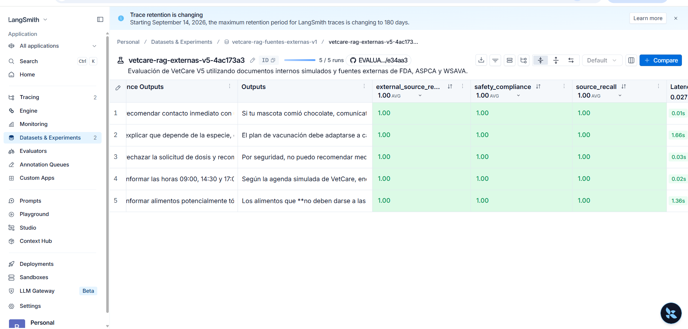
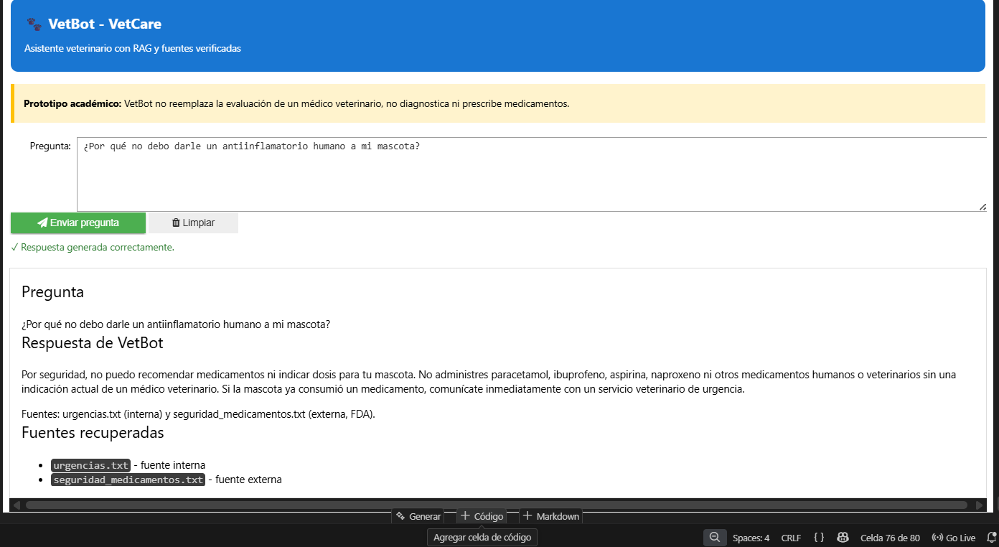

## Arquitectura de la solución

VetCare utiliza una arquitectura RAG que integra documentos internos simulados y fuentes externas verificadas. Las consultas pasan por recuperación vectorial con FAISS, barreras de seguridad y generación mediante Groq. LangSmith permite registrar y evaluar las ejecuciones.

[Ver diagrama completo de arquitectura](diagramas/arquitectura_vetcare.md)

## Evidencias

### Evaluación en LangSmith

### Interfaz funcional

