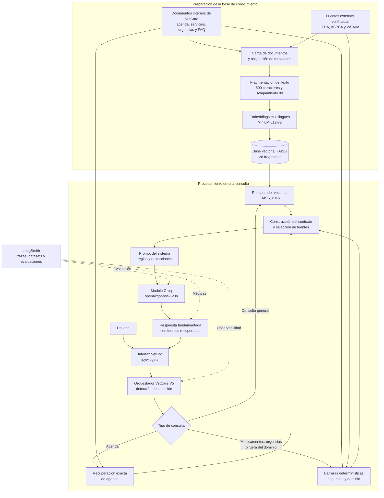

# Arquitectura del chatbot VetCare

El sistema utiliza una arquitectura RAG que combina documentos internos simulados de VetCare con fuentes externas oficiales. Las consultas pasan por reglas de seguridad, recuperación de información y generación de respuestas mediante Groq. LangSmith registra y evalúa el funcionamiento del sistema.

## Componentes principales

- **Fuentes internas:** información simulada sobre agenda, servicios, cuidados, preguntas frecuentes y urgencias de VetCare.
- **Fuentes externas:** documentos elaborados a partir de información oficial de FDA, ASPCA y WSAVA.
- **Embeddings:** modelo `paraphrase-multilingual-MiniLM-L12-v2`.
- **Base vectorial:** FAISS con los fragmentos de los documentos internos y externos.
- **Modelo generativo:** `openai/gpt-oss-120b`, utilizado mediante la API de Groq.
- **Seguridad:** barreras determinísticas para medicamentos, urgencias, reservas y preguntas fuera del dominio.
- **Observabilidad:** LangSmith registra las ejecuciones y permite evaluar recuperación, seguridad y uso de fuentes.